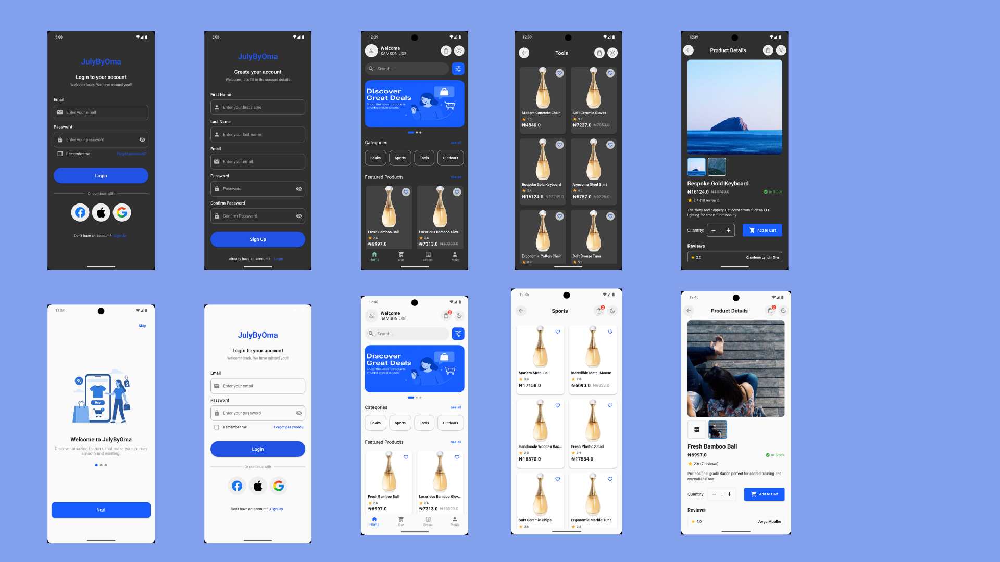
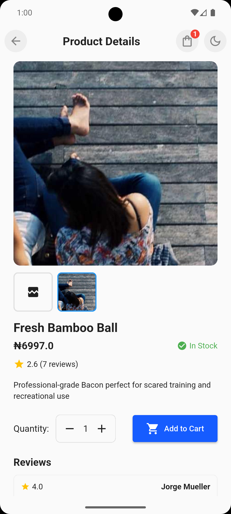

# Flutter E-commerce App

This project is a Flutter E-commerce Mobile Application built with Clean Architecture and BLoC (Business Logic Component) for state management. It provides a scalable, testable, and maintainable codebase that follows SOLID principles.


## Features

- Onboarding screens with smooth page indicators

- Authentication (Login / Register)

- Product listing & product details

- Shopping cart with checkout flow

- Persistent local storage with SharedPreferences

- REST API integration using Dio

- Centralized dependency injection using GetIt

- Error handling with Dartz (Either & Option types)

- Logging with Logger for debugging

## Architecture

This app follows Clean Architecture with separation of concerns into 3 main layers:

```bash

lib/
├── core/                # Shared utilities (errors, constants, helpers)
├── features/            # Each feature has its own folder
│   ├── auth/
│   │   ├── data/        # Data layer (repositories, datasources, models)
│   │   ├── domain/      # Domain layer (entities, repositories, use cases)
│   │   ├── presentation/# Presentation layer (bloc, pages, widgets)
│   │
│   ├── product/
│   │   ├── data/
│   │   ├── domain/
│   │   ├── presentation/
│   │
│   └── cart/
│       ├── data/
│       ├── domain/
│       ├── presentation/
│
├── injection.dart       # GetIt service locator setup
└── main.dart            # Entry point


```

## Layer Responsibilities

- Domain Layer

Business rules (Entities, Use Cases, Repository contracts).

- Data Layer

Implements repositories using Dio for API calls and SharedPreferences for local persistence.

- Presentation Layer

Handles UI with Flutter widgets and Bloc/Cubit for state management.


## Getting Started
### Prerequisites

- Flutter SDK >= 3.x

- Dart >= 3.x

### Installation


- Clone the repository

```bash
git clone https://github.com/psalmsin1759/ecommerce_flutter_clean_architecture_bloc.git
cd ecommerce_flutter_clean_architecture_bloc

```
### Get dependencies
```bash
flutter pub get
```

### Run the app
```bash
flutter run

```


### Testing

Run unit tests with:
```bash
flutter test

```

### Demo Video

<!-- [](https://github.com/psalmsin1759/ecommerce_flutter_clean_architecture_bloc/docs/demo.mp4) -->

<video src="./docs/demo.mp4" controls="controls" width="300" height="600">
  Your browser does not support the video tag.
</video>

### Screenshots







